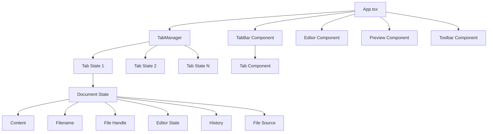

# Tab-Management Design Document

## Overview

The Tab-Management feature will transform the Markdown Editor Pro from a single-document editor into a multi-document workspace. This design document outlines the architectural approach to implement tabs while maintaining the existing functionality and performance characteristics of the application.

The implementation will introduce a new tab system that manages multiple document states, each with its own content, filename, file handle, editor state, and history. The preview area will remain singular and always display the content of the currently active tab.

## Architecture

### High-Level Architecture Changes

The current architecture centers around a single document state in `App.tsx`. The tab system will introduce a **TabManager** abstraction that manages multiple document states while maintaining the same interface to existing components.



### State Management Strategy

Instead of replacing the existing state management, we'll introduce a **tab-aware state layer** that:

1. **Preserves existing component interfaces** - No changes to Editor, Preview, or Toolbar components
2. **Manages multiple document states** - Each tab maintains its complete state
3. **Provides active tab abstraction** - Current components see only the active tab's state
4. **Handles persistence** - Saves/restores all tab states to/from localStorage

## Components and Interfaces

### New Components

#### 1. TabBar Component (`components/TabBar.tsx`)

**Purpose:** Renders the tab navigation interface above the editor area.

**Props Interface:**
```typescript
interface TabBarProps {
  tabs: Tab[];
  activeTabId: string;
  onTabSelect: (tabId: string) => void;
  onTabClose: (tabId: string) => void;
  onTabCreate: () => void;
  onTabContextMenu: (tabId: string, event: React.MouseEvent) => void;
  theme: 'light' | 'dark';
}
```

**Features:**
- Horizontal scrollable tab list
- Visual indicators for active tab and unsaved changes
- Close buttons with hover states
- Context menu support
- Keyboard navigation support
- Theme-aware styling

#### 2. Tab Component (`components/Tab.tsx`)

**Purpose:** Individual tab representation within the TabBar.

**Props Interface:**
```typescript
interface TabProps {
  tab: Tab;
  isActive: boolean;
  onSelect: () => void;
  onClose: () => void;
  onContextMenu: (event: React.MouseEvent) => void;
  theme: 'light' | 'dark';
}
```

**Features:**
- Truncated filename display with tooltip
- Unsaved changes indicator (dot/asterisk)
- Close button with confirmation for unsaved changes
- Drag and drop support (future enhancement)

#### 3. TabContextMenu Component (`components/TabContextMenu.tsx`)

**Purpose:** Right-click context menu for tab operations.

**Props Interface:**
```typescript
interface TabContextMenuProps {
  isOpen: boolean;
  position: { x: number; y: number };
  tabId: string;
  onClose: () => void;
  onCloseTab: (tabId: string) => void;
  onCloseOtherTabs: (tabId: string) => void;
  onCloseAllTabs: () => void;
  onDuplicateTab: (tabId: string) => void;
}
```

### Enhanced Types

#### Tab State Type

```typescript
interface Tab {
  id: string;
  filename: string;
  content: string;
  fileHandle: FileSystemFileHandle | null;
  fileSource: FileSource;
  originalContent: string; // For GitHub change tracking
  history: string[];
  historyIndex: number;
  editorState: {
    cursorPosition: number;
    scrollPosition: number;
    selection: { start: number; end: number };
  };
  hasUnsavedChanges: boolean;
  createdAt: number;
  lastModified: number;
}

interface TabManagerState {
  tabs: Tab[];
  activeTabId: string;
  nextTabId: number;
}
```

#### Enhanced App State

```typescript
interface AppState {
  // Existing state remains for backward compatibility
  markdown: string;
  fileName: string;
  settings: EditorSettings;
  // ... other existing state
  
  // New tab-related state
  tabManager: TabManagerState;
  isTabContextMenuOpen: boolean;
  tabContextMenuPosition: { x: number; y: number };
  tabContextMenuTabId: string | null;
}
```

### Modified Components

#### App.tsx Changes

**New Responsibilities:**
- Initialize and manage TabManager
- Provide tab operations (create, close, switch, duplicate)
- Handle tab persistence to localStorage
- Manage tab context menu state
- Coordinate between active tab state and existing component props

**Key Methods:**
```typescript
// Tab management methods
const createNewTab = (content?: string, filename?: string) => void;
const closeTab = (tabId: string) => void;
const switchToTab = (tabId: string) => void;
const duplicateTab = (tabId: string) => void;
const closeOtherTabs = (tabId: string) => void;
const closeAllTabs = () => void;

// State synchronization methods
const syncActiveTabToState = () => void;
const syncStateToActiveTab = () => void;
const persistTabState = () => void;
const restoreTabState = () => void;
```

#### Toolbar.tsx Changes

**New Props:**
```typescript
interface ToolbarProps {
  // ... existing props
  
  // Tab-related props
  tabs: Tab[];
  activeTabId: string;
  onTabCreate: () => void;
}
```

**Modified Behavior:**
- "New" button creates new tab instead of clearing current content
- File operations (Open, Save) work with active tab
- Visual indication when multiple tabs are open

## Data Models

### Tab Persistence Model

**localStorage Structure:**
```typescript
interface PersistedTabState {
  version: string; // For future migration support
  tabs: {
    id: string;
    filename: string;
    content: string;
    fileSource: FileSource;
    originalContent: string;
    history: string[];
    historyIndex: number;
    editorState: {
      cursorPosition: number;
      scrollPosition: number;
      selection: { start: number; end: number };
    };
    hasUnsavedChanges: boolean;
    createdAt: number;
    lastModified: number;
  }[];
  activeTabId: string;
  settings: EditorSettings;
}
```

**Migration Strategy:**
- Detect existing single-document localStorage data
- Migrate to tab format with single tab
- Preserve all existing functionality

### Tab State Synchronization

**Active Tab Sync Pattern:**
```typescript
// When switching tabs
const switchToTab = (tabId: string) => {
  // 1. Save current editor state to current active tab
  syncStateToActiveTab();
  
  // 2. Switch active tab
  setActiveTabId(tabId);
  
  // 3. Load new active tab state to app state
  syncActiveTabToState();
  
  // 4. Persist changes
  persistTabState();
};
```

## Error Handling

### Tab State Recovery

**Corruption Handling:**
1. **Individual Tab Corruption:** Skip corrupted tab, log warning, continue with remaining tabs
2. **Complete State Corruption:** Fall back to single default tab
3. **localStorage Unavailable:** Continue with in-memory state only

**Error Scenarios:**
```typescript
interface TabErrorHandler {
  handleCorruptedTab: (tabId: string, error: Error) => void;
  handlePersistenceFailure: (error: Error) => void;
  handleFileHandleError: (tabId: string, error: Error) => void;
  recoverFromCorruptedState: () => void;
}
```

### File Handle Management

**File Handle Persistence:**
- File handles cannot be serialized to localStorage
- Store file handle references in memory only
- Gracefully degrade to "Save As" when handle is lost
- Provide user feedback when file handle is unavailable

## Testing Strategy

### Unit Testing

**Tab Manager Tests:**
```typescript
describe('TabManager', () => {
  test('creates new tab with default content');
  test('switches between tabs preserving state');
  test('closes tab with unsaved changes confirmation');
  test('handles tab state persistence');
  test('recovers from corrupted tab state');
  test('migrates legacy single-document state');
});
```

**Component Tests:**
```typescript
describe('TabBar', () => {
  test('renders tabs with correct visual states');
  test('handles tab selection and closing');
  test('provides keyboard navigation');
  test('shows context menu on right-click');
});
```

### Integration Testing

**End-to-End Scenarios:**
1. **Multi-Tab Workflow:** Create multiple tabs, edit content, switch between tabs, verify state preservation
2. **File Operations:** Open files in new tabs, save files from different tabs, verify file associations
3. **GitHub Integration:** Load GitHub files in tabs, commit changes from specific tabs
4. **Persistence:** Reload browser, verify all tabs and states are restored
5. **Error Recovery:** Corrupt localStorage, verify graceful fallback

### Performance Testing

**Memory Usage:**
- Monitor memory consumption with multiple tabs (target: <50MB for 10 tabs)
- Test garbage collection of closed tabs
- Verify no memory leaks in tab switching

**Rendering Performance:**
- Measure tab switching time (target: <100ms)
- Test with large documents (>1MB markdown files)
- Verify smooth scrolling in tab bar with many tabs

## Implementation Phases

### Phase 1: Core Tab Infrastructure
**Duration:** 3-4 days
**Scope:**
- Implement Tab and TabManager types
- Create TabBar and Tab components
- Basic tab creation, switching, and closing
- Simple persistence to localStorage

**Deliverables:**
- Working tab bar above editor
- Ability to create and switch between tabs
- Basic state preservation per tab

### Phase 2: Advanced Tab Features
**Duration:** 2-3 days
**Scope:**
- Tab context menu implementation
- Keyboard shortcuts for tab navigation
- Unsaved changes indicators and confirmation dialogs
- Tab state migration from existing localStorage

**Deliverables:**
- Complete tab management functionality
- Seamless migration from single-document mode
- Full keyboard navigation support

### Phase 3: Integration and Polish
**Duration:** 2-3 days
**Scope:**
- File operations integration (Open in new tab, Save from active tab)
- GitHub integration with tab awareness
- Visual polish and theme integration
- Performance optimization

**Deliverables:**
- Complete integration with existing features
- Polished user experience
- Performance benchmarks met

### Phase 4: Testing and Documentation
**Duration:** 1-2 days
**Scope:**
- Comprehensive testing suite
- Documentation updates
- Error handling refinement
- User acceptance testing

**Deliverables:**
- Full test coverage
- Updated documentation
- Production-ready feature

## Technical Considerations

### Bundle Size Impact

**Estimated Impact:** +15-20KB (minified + gzipped)
- New components: ~10KB
- Enhanced state management: ~5KB
- Additional utilities: ~5KB

**Mitigation Strategies:**
- Code splitting for tab-related components
- Tree shaking optimization
- Minimize external dependencies

### Browser Compatibility

**File System Access API:**
- Tab-specific file handles work with existing fallback strategy
- No additional compatibility concerns
- Graceful degradation maintained

### Accessibility

**ARIA Support:**
```typescript
// Tab bar accessibility
<div role="tablist" aria-label="Document tabs">
  <button 
    role="tab" 
    aria-selected={isActive}
    aria-controls={`tabpanel-${tab.id}`}
    id={`tab-${tab.id}`}
  >
    {tab.filename}
  </button>
</div>

// Editor area accessibility
<div 
  role="tabpanel" 
  aria-labelledby={`tab-${activeTab.id}`}
  id={`tabpanel-${activeTab.id}`}
>
  {/* Editor content */}
</div>
```

**Keyboard Navigation:**
- Tab key navigation through tab bar
- Arrow keys for tab selection
- Enter/Space for tab activation
- Delete key for tab closing (with confirmation)

### Security Considerations

**localStorage Security:**
- No sensitive data stored in tab state
- File handles remain in memory only
- GitHub tokens managed by existing security layer

**XSS Prevention:**
- All tab names sanitized before display
- Content sanitization handled by existing DOMPurify integration

## Migration Strategy

### Backward Compatibility

**Existing User Data:**
1. **Detection:** Check for existing single-document localStorage data
2. **Migration:** Convert to single-tab format preserving all data
3. **Validation:** Ensure no data loss during migration
4. **Fallback:** Maintain ability to export/import old format

**Migration Code:**
```typescript
const migrateFromLegacyState = (): TabManagerState => {
  const legacyContent = localStorage.getItem('markdown-editor-content');
  const legacyFilename = localStorage.getItem('markdown-editor-filename');
  
  if (legacyContent || legacyFilename) {
    return {
      tabs: [{
        id: generateTabId(),
        filename: legacyFilename || 'untitled.md',
        content: legacyContent || '',
        // ... other default properties
      }],
      activeTabId: generateTabId(),
      nextTabId: 2
    };
  }
  
  return getDefaultTabState();
};
```

### Rollback Strategy

**Feature Flag Approach:**
- Implement feature flag for tab system
- Allow users to disable tabs and revert to single-document mode
- Maintain both code paths during transition period

## Future Enhancements

### Planned Improvements

1. **Tab Reordering:** Drag and drop tab reordering
2. **Tab Groups:** Organize tabs into collapsible groups
3. **Session Management:** Save and restore tab sessions
4. **Split View:** View multiple tabs simultaneously
5. **Tab Search:** Quick search through open tabs
6. **Recent Tabs:** Recently closed tabs recovery

### Extension Points

**Plugin Architecture:**
- Tab lifecycle hooks for extensions
- Custom tab types (e.g., preview-only tabs)
- Tab-specific toolbar extensions
- Custom persistence providers

This design provides a solid foundation for implementing the Tab-Management feature while maintaining the existing architecture and user experience. The phased approach ensures incremental delivery and reduces implementation risk.