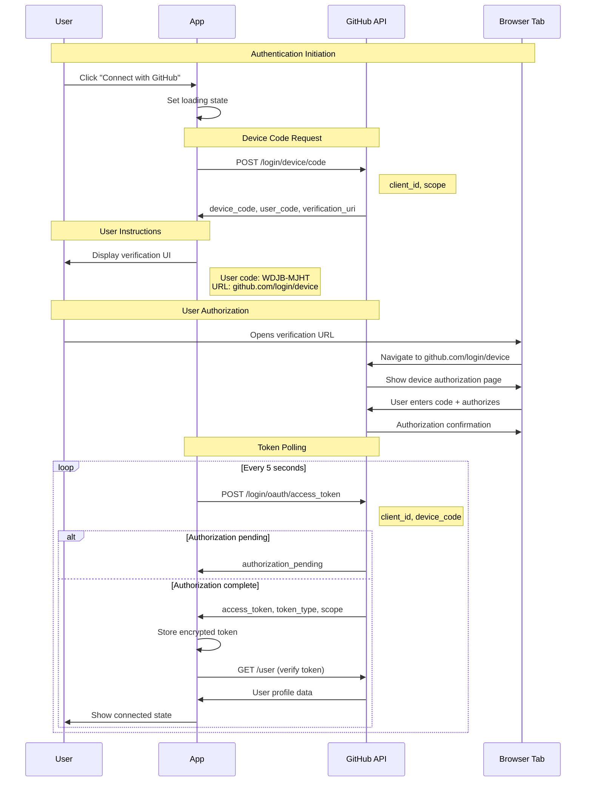
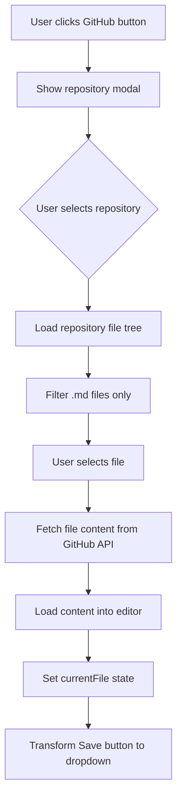
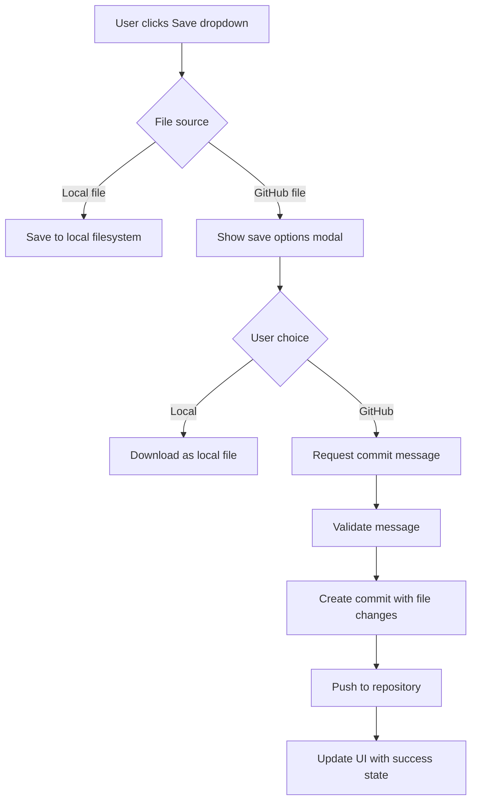
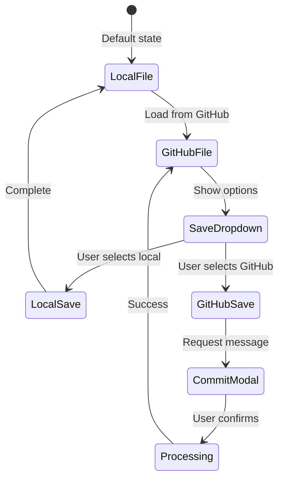

# GitHub Integration Feature Design

## Planning Documentation

### Initial Requirements Analysis

**User Request Translation:**
The user requested a GitHub integration feature with the following specific requirements:
- Optional GitHub connection with clear "Connect with GitHub" button
- Button changes to "GitHub $UserName" when connected
- Repository browsing (all repositories or filtered selection)
- Markdown file loading from GitHub repositories (only .md files visible)
- Enhanced save functionality: local save OR GitHub commit with custom message
- Persistent login across browser sessions
- Disconnect functionality

**Feasibility Assessment:**
✅ **Technically Feasible** - All requirements can be implemented using:
- GitHub REST API via Octokit
- OAuth Device Flow for authentication
- Browser localStorage for session persistence
- File System Access API integration (existing pattern)

**Architectural Compatibility:**
✅ **Fully Compatible** - The feature aligns with existing architecture:
- Component-based React structure
- Centralized state management in App.tsx
- TypeScript type safety
- No backend requirement (client-side only)
- NPM package management (following project specifications)

### Design Decision Rationale

**Authentication Strategy Selection:**
- **Chosen**: GitHub Device Flow
- **Alternatives Considered**: 
  - GitHub OAuth Apps (requires backend)
  - Personal Access Tokens (poor UX)
  - GitHub CLI integration (platform dependent)
- **Rationale**: Device Flow provides secure, user-friendly auth without backend requirements

**State Management Architecture:**
- **Chosen**: Extend existing App.tsx centralized state
- **Alternatives Considered**:
  - React Context for GitHub state
  - Separate state management library
  - Component-level state
- **Rationale**: Maintains consistency with existing patterns, simpler debugging

**API Client Selection:**
- **Chosen**: @octokit/rest with @octokit/auth-oauth-device
- **Alternatives Considered**:
  - Direct fetch() API calls
  - Axios with manual auth handling
  - GraphQL API (@octokit/graphql)
- **Rationale**: Official GitHub SDK, built-in rate limiting, TypeScript support

**UI Integration Strategy:**
- **Chosen**: Enhance existing Toolbar with GitHub button and save dropdown
- **Alternatives Considered**:
  - Separate GitHub panel/sidebar
  - Menu bar integration
  - Floating action buttons
- **Rationale**: Minimal UI disruption, follows existing button patterns

### Risk Assessment & Mitigation

**Technical Risks:**
1. **GitHub API Rate Limiting**
   - Risk: 5000 requests/hour limit could be exceeded
   - Mitigation: Implement caching, show rate limit status, graceful degradation

2. **Token Security**
   - Risk: Access tokens in localStorage vulnerable to XSS
   - Mitigation: Token encryption, secure storage practices, automatic expiry

3. **Large Repository Performance**
   - Risk: Repositories with thousands of files cause slow loading
   - Mitigation: Pagination, lazy loading, file filtering at API level

4. **Network Connectivity**
   - Risk: Offline usage breaks GitHub functionality
   - Mitigation: Offline detection, graceful degradation, local file fallback

**UX Risks:**
1. **Complex Authentication Flow**
   - Risk: Users confused by device flow process
   - Mitigation: Clear instructions, progress indicators, help documentation

2. **Repository Discovery**
   - Risk: Users can't find their repositories easily
   - Mitigation: Search functionality, repository filtering, recent repos

### Implementation Planning

**Development Phases:**

**Phase 1: Core Infrastructure (Week 1)**
- GitHub API service layer
- Authentication flow implementation
- Basic state management
- Token persistence

**Phase 2: UI Components (Week 2)**
- GitHubButton component
- Repository browser modal
- File selection interface
- Loading and error states

**Phase 3: File Operations (Week 3)**
- Load files from GitHub
- Enhanced save functionality
- Commit message interface
- Push operations

**Phase 4: Polish & Testing (Week 4)**
- Error handling refinement
- Performance optimization
- User testing and feedback
- Documentation updates

**Integration Points with Existing Code:**
- App.tsx: Add GitHub state and service integration
- Toolbar.tsx: Enhance with GitHub button and save dropdown
- types.ts: Add GitHub-related type definitions
- package.json: Add new dependencies

### Architecture Impact Analysis

**Component Hierarchy Changes:**
```
App.tsx (enhanced with GitHub state)
├── Toolbar.tsx (enhanced with GitHub integration)
│   ├── GitHubButton.tsx (new)
│   └── SaveDropdown.tsx (enhanced)
├── GitHubModal.tsx (new)
├── SaveOptionsModal.tsx (new)
└── [existing components unchanged]
```

**State Flow Modifications:**
- GitHub authentication state flows from App → Toolbar → GitHubButton
- Repository data flows from GitHubService → App → GitHubModal
- File operations trigger state updates in App and affect save behavior

**Dependency Impact:**
- New dependencies: @octokit/rest, @octokit/auth-oauth-device, js-base64
- Bundle size increase: ~150KB (estimated)
- Build process: No changes required (Vite handles new dependencies)

## Overview

This document outlines the design for integrating GitHub connectivity into the Markdown Editor Pro application, enabling users to directly load, edit, and save markdown files from their GitHub repositories. The integration maintains the application's core principles of simplicity and privacy while adding powerful collaborative capabilities.

### Key Requirements
- **Optional Integration**: GitHub connection is entirely optional and doesn't affect core functionality
- **Persistent Authentication**: Login state persists across browser sessions
- **Repository Selection**: Users can choose to view all repositories or filter to specific ones
- **File Operations**: Load `.md` files directly from GitHub repositories into the editor
- **Save Options**: Enhanced save functionality with local or GitHub commit/push options
- **User Experience**: Clear visual indicators for connection state and seamless workflow integration

## Technology Stack & Dependencies

### Dependency Analysis & Selection

**Current Project Dependencies Audit:**
- React 19.1.1: Latest version, excellent GitHub API integration support
- TypeScript 5.8.2: Strong typing for GitHub API responses
- Vite 7.0.6: Fast bundling, handles new dependencies efficiently
- Existing auth patterns: localStorage usage established

**New Dependencies Justification:**

#### @octokit/rest (^20.0.2)
- **Purpose**: Official GitHub REST API client
- **Why chosen**: 
  - Official GitHub SDK with full API coverage
  - Built-in TypeScript definitions
  - Automatic rate limiting and retry logic
  - Consistent with project's NPM-only dependency policy
- **Size impact**: ~85KB gzipped
- **Alternatives rejected**:
  - Manual fetch(): Too much boilerplate, no rate limiting
  - Axios + custom wrapper: Reinventing the wheel

#### @octokit/auth-oauth-device (^6.0.1)
- **Purpose**: Handle GitHub Device Flow authentication
- **Why chosen**:
  - Secure authentication without backend
  - User-friendly flow (no redirect required)
  - Automatic token refresh handling
- **Size impact**: ~15KB gzipped
- **Integration**: Works seamlessly with @octokit/rest

#### js-base64 (^3.7.5)
- **Purpose**: Encode/decode file content for GitHub API
- **Why chosen**:
  - GitHub API requires base64 encoding for file operations
  - Lightweight, well-maintained library
  - Better browser compatibility than native btoa/atob
- **Size impact**: ~8KB gzipped

**Total Bundle Impact**: ~108KB additional (estimated 15% increase)
**Performance Consideration**: Code splitting will ensure GitHub features only load when needed

### Required New Dependencies
```json
{
  "@octokit/rest": "^20.0.2",
  "@octokit/auth-oauth-device": "^6.0.1",
  "js-base64": "^3.7.5"
}
```

**Installation Command:**
```bash
npm install @octokit/rest @octokit/auth-oauth-device js-base64
```

**Development Dependencies Consideration:**
- @types packages not needed (TypeScript definitions included)
- No additional dev tooling required
- Existing test framework compatible with new features

### GitHub API Integration Strategy

**API Endpoint Usage Planning:**
- **Authentication**: `/login/device/code` and `/login/oauth/access_token`
- **User Info**: `/user` (get authenticated user)
- **Repositories**: `/user/repos` (list repositories)
- **Repository Contents**: `/repos/{owner}/{repo}/contents/{path}` (browse files)
- **File Operations**: `/repos/{owner}/{repo}/contents/{path}` (get/update files)
- **Commits**: `/repos/{owner}/{repo}/git/commits` (create commits)

**Rate Limiting Strategy:**
- Primary limit: 5,000 requests/hour for authenticated requests
- Secondary limit: 1,000 requests/hour for search
- Mitigation: Aggressive caching, request batching, user feedback
- Implementation: @octokit/rest handles limits automatically

**Error Handling Categories:**
1. **Network Errors**: Offline detection, retry mechanisms
2. **Authentication Errors**: Token refresh, re-auth prompts
3. **Permission Errors**: Clear user messaging, fallback options
4. **Rate Limit Errors**: Wait time display, operation queuing

**Security Considerations:**
- Minimal scope requests: Only `repo` scope for private repos, `public_repo` for public
- Token storage encryption using Web Crypto API
- No sensitive data in URLs or logs
- Automatic token cleanup on disconnect

## Component Architecture

### Architecture Planning Process

**Current Component Analysis:**
Existing toolbar structure in `Toolbar.tsx`:
- File operations: New, Open, Save buttons (right-aligned)
- Formatting tools: Bold, Italic, Headers, etc. (left-aligned)
- Dropdowns: Code language, Export, Help menus
- Theme selector and filename input

**Integration Strategy Decision:**
- **Approach**: Enhance existing components rather than creating separate GitHub section
- **Rationale**: Maintains UI consistency, reduces cognitive load
- **Implementation**: GitHub button integrates with existing file operations group

**Component Responsibility Analysis:**

#### Existing Components to Modify:
1. **App.tsx**: Add GitHub state management
2. **Toolbar.tsx**: Integrate GitHub button and enhance save functionality
3. **types.ts**: Add GitHub-related type definitions

#### New Components Required:
1. **GitHubButton**: GitHub connection management
2. **GitHubModal**: Repository and file browsing
3. **SaveOptionsModal**: Enhanced save workflow

### New Components

#### GitHubButton Component

**Design Decisions:**
- **Location**: Toolbar, positioned near existing file operations
- **States**: Disconnected, Connecting, Connected, Error
- **Visual Design**: Follows existing button styling patterns
- **Accessibility**: Full keyboard navigation, screen reader support

**State Management Strategy:**
```typescript
interface GitHubButtonState {
  connectionStatus: 'disconnected' | 'connecting' | 'connected' | 'error';
  user?: GitHubUser;
  lastError?: string;
}
```

**Props Interface Planning:**
```typescript
interface GitHubButtonProps {
  // Connection state
  isConnected: boolean;
  userName?: string;
  userAvatar?: string;
  
  // Actions
  onConnect: () => void;
  onDisconnect: () => void;
  onBrowseRepos: () => void;
  
  // UI state
  isLoading?: boolean;
  error?: string;
  
  // Styling consistency
  className?: string;
}
```

**Dropdown Menu Structure:**
- Connected state dropdown:
  - "Browse Repositories" (primary action)
  - "View Profile" (secondary action)
  - "Disconnect" (destructive action)

#### GitHubModal Component

**Modal Design Rationale:**
- **Z-index**: z-[9999] following project specifications
- **Rendering location**: App.tsx level to avoid stacking context issues
- **Size**: Large modal (80% viewport) to accommodate file tree
- **Responsive**: Adapts to mobile screens

**Information Architecture:**
```
Modal Header
├── Title: "Browse GitHub Repositories"
├── User info display
└── Close button

Modal Body (Two-column layout)
├── Left Column: Repository List
│   ├── Search/filter input
│   ├── Repository cards with metadata
│   └── Pagination controls
└── Right Column: File Browser
    ├── Breadcrumb navigation
    ├── File tree (folders + .md files only)
    └── File preview panel
```

**User Experience Flow:**
1. User clicks "Browse Repositories"
2. Modal opens with repository list loading
3. User searches/filters repositories
4. User selects repository → file tree loads
5. User navigates folders → sees only .md files
6. User clicks .md file → file loads into editor
7. Modal closes automatically

**Performance Optimizations:**
- Virtual scrolling for large repository lists
- Debounced search (300ms delay)
- Lazy loading of file trees
- Cached repository metadata

```typescript
interface GitHubModalProps {
  // Visibility
  isOpen: boolean;
  onClose: () => void;
  
  // Data
  repositories: Repository[];
  selectedRepository?: Repository;
  currentPath: string;
  files: GitHubFile[];
  
  // Actions
  onRepositorySelect: (repo: Repository) => void;
  onFileSelect: (file: GitHubFile) => void;
  onNavigate: (path: string) => void;
  
  // State
  isLoading: boolean;
  isLoadingFiles: boolean;
  error?: string;
  
  // Configuration
  showPrivateRepos: boolean;
  fileFilter: 'all' | 'markdown-only';
}
```

#### SaveOptionsModal Component

**Modal Trigger Logic:**
- Appears when user clicks save and a GitHub file is currently loaded
- Does NOT appear for local files (maintains existing behavior)
- Provides clear choice between local and GitHub save

**UI Design:**
```
Modal: "Save Options"
├── Current file info display
├── Option 1: "Save to Local Device" (download)
└── Option 2: "Commit to GitHub"
    ├── Commit message input (required)
    ├── Branch selection (if multiple branches)
    └── Action buttons: "Commit" vs "Commit & Push"
```

**Validation Logic:**
- Commit message: Required, minimum 10 characters
- Branch selection: Default to current branch
- Network connectivity check before commit
- File change detection (prevent unnecessary commits)

```typescript
interface SaveOptionsModalProps {
  // Visibility
  isOpen: boolean;
  onClose: () => void;
  
  // Current file context
  currentFile?: GitHubFile;
  hasChanges: boolean;
  
  // Save actions
  onLocalSave: () => void;
  onGitHubSave: (options: CommitOptions) => void;
  
  // State
  isCommitting: boolean;
  commitError?: string;
  
  // GitHub context
  isConnected: boolean;
  canPush: boolean; // Repository permissions
}
```

### Enhanced Components

#### Toolbar Component Extensions

**Modification Planning:**
- **Save Button Enhancement**: Replace single save button with conditional dropdown
- **GitHub Button Integration**: Add GitHub button near file operations
- **Responsive Behavior**: Ensure new elements work on mobile

**Save Button Logic Changes:**
```typescript
// Current: Simple save button
<button onClick={onSave}>Save</button>

// Enhanced: Conditional dropdown
{currentFile?.source === 'github' ? (
  <SaveDropdown 
    onLocalSave={handleLocalSave}
    onGitHubSave={handleGitHubSave}
  />
) : (
  <button onClick={onSave}>Save</button>
)}
```

**Integration Points:**
- GitHub button positioned between export dropdown and theme selector
- Save dropdown replaces save button when GitHub file is loaded
- Maintains existing keyboard shortcuts and accessibility

#### App Component State Extensions

**State Structure Planning:**
```typescript
// Existing state (maintained)
interface ExistingAppState {
  markdown: string;
  fileName: string;
  settings: EditorSettings;
  history: string[];
  historyIndex: number;
  // ... other existing state
}

// New GitHub state (added)
interface GitHubState {
  // Authentication
  isConnected: boolean;
  user: GitHubUser | null;
  accessToken: string | null;
  
  // Repository data
  repositories: Repository[];
  currentRepository: Repository | null;
  
  // File operations
  currentFile: GitHubFile | null;
  isLoadingRepos: boolean;
  isLoadingFile: boolean;
  
  // UI state
  isGitHubModalOpen: boolean;
  isSaveOptionsModalOpen: boolean;
  
  // Error handling
  error: string | null;
}
```

**State Management Integration:**
- GitHub state co-exists with existing state
- No changes to existing state structure
- GitHub operations update both GitHub and existing state
- localStorage persistence extended for GitHub tokens

## Data Models

### Core Types
```typescript
interface GitHubUser {
  login: string;
  name: string;
  avatar_url: string;
  id: number;
}

interface Repository {
  id: number;
  name: string;
  full_name: string;
  owner: {
    login: string;
    avatar_url: string;
  };
  private: boolean;
  default_branch: string;
}

interface GitHubFile {
  name: string;
  path: string;
  sha: string;
  content: string;
  repository: Repository;
  branch: string;
}

interface CommitOptions {
  message: string;
  content: string;
  sha?: string; // For updates
  branch?: string;
}
```

## Authentication Flow

## Authentication Flow

### Authentication Strategy Analysis

**Requirement**: Secure GitHub authentication without backend infrastructure

**Available Options Analysis:**
1. **GitHub OAuth Apps**: Requires backend for secret storage ❌
2. **Personal Access Tokens**: Poor UX, security concerns ❌ 
3. **GitHub Apps**: Complex setup, overkill for use case ❌
4. **Device Flow**: Perfect fit for client-side apps ✅

**Device Flow Selection Rationale:**
- No backend required (aligns with project architecture)
- Secure (no client secrets exposed)
- User-friendly (familiar OAuth experience)
- Officially supported by GitHub
- Works across all device types

### Device Flow Implementation Planning

**Authentication Sequence:**



**Implementation Details:**

#### Step 1: Device Code Request
```typescript
// GitHub App Configuration (public - no secrets)
const GITHUB_CLIENT_ID = 'your_github_app_client_id';
const DEVICE_CODE_URL = 'https://github.com/login/device/code';
const ACCESS_TOKEN_URL = 'https://github.com/login/oauth/access_token';

// Initiate device flow
async function initiateDeviceFlow(): Promise<DeviceCodeResponse> {
  const response = await fetch(DEVICE_CODE_URL, {
    method: 'POST',
    headers: {
      'Accept': 'application/json',
      'Content-Type': 'application/json'
    },
    body: JSON.stringify({
      client_id: GITHUB_CLIENT_ID,
      scope: 'repo' // Full repository access
    })
  });
  return response.json();
}
```

#### Step 2: User Interface During Authentication
```typescript
// Authentication Modal UI State
interface AuthModalState {
  step: 'requesting' | 'pending' | 'complete' | 'error';
  userCode?: string;
  verificationUri?: string;
  expiresIn?: number;
  interval?: number;
  error?: string;
}
```

**UI Design for Authentication Modal:**
```
┌─────────────────────────────────────┐
│ Connect to GitHub                   │
├─────────────────────────────────────┤
│                                     │
│ 1. Visit: github.com/login/device   │
│                                     │
│ 2. Enter this code:                 │
│    ┌─────────────┐                 │
│    │  WDJB-MJHT  │ [Copy]          │
│    └─────────────┘                 │
│                                     │
│ 3. Authorize Markdown Editor Pro    │
│                                     │
│ ⏳ Waiting for authorization...      │
│                                     │
│ [Cancel]                            │
└─────────────────────────────────────┘
```

#### Step 3: Token Polling Implementation
```typescript
async function pollForAccessToken(
  deviceCode: string, 
  interval: number
): Promise<AccessTokenResponse> {
  return new Promise((resolve, reject) => {
    const pollInterval = setInterval(async () => {
      try {
        const response = await fetch(ACCESS_TOKEN_URL, {
          method: 'POST',
          headers: {
            'Accept': 'application/json',
            'Content-Type': 'application/json'
          },
          body: JSON.stringify({
            client_id: GITHUB_CLIENT_ID,
            device_code: deviceCode,
            grant_type: 'urn:ietf:params:oauth:grant-type:device_code'
          })
        });
        
        const data = await response.json();
        
        if (data.access_token) {
          clearInterval(pollInterval);
          resolve(data);
        } else if (data.error === 'authorization_pending') {
          // Continue polling
          return;
        } else {
          clearInterval(pollInterval);
          reject(new Error(data.error_description || data.error));
        }
      } catch (error) {
        clearInterval(pollInterval);
        reject(error);
      }
    }, interval * 1000);
    
    // Timeout after 15 minutes
    setTimeout(() => {
      clearInterval(pollInterval);
      reject(new Error('Authentication timeout'));
    }, 15 * 60 * 1000);
  });
}
```

### Persistent Storage Strategy

**Security Requirements:**
- Access tokens must be encrypted at rest
- Tokens should expire automatically
- Secure cleanup on disconnect
- Prevent token leakage through DevTools

**Encryption Implementation:**
```typescript
class SecureTokenStorage {
  private static readonly STORAGE_KEY = 'github_token_encrypted';
  private static readonly USER_KEY = 'github_user_data';
  
  // Encrypt token using Web Crypto API
  static async storeToken(token: string): Promise<void> {
    const key = await crypto.subtle.generateKey(
      { name: 'AES-GCM', length: 256 },
      true,
      ['encrypt', 'decrypt']
    );
    
    const iv = crypto.getRandomValues(new Uint8Array(12));
    const encodedToken = new TextEncoder().encode(token);
    
    const encrypted = await crypto.subtle.encrypt(
      { name: 'AES-GCM', iv },
      key,
      encodedToken
    );
    
    const exportedKey = await crypto.subtle.exportKey('raw', key);
    
    localStorage.setItem(this.STORAGE_KEY, JSON.stringify({
      encrypted: Array.from(new Uint8Array(encrypted)),
      iv: Array.from(iv),
      key: Array.from(new Uint8Array(exportedKey)),
      timestamp: Date.now()
    }));
  }
  
  // Decrypt and retrieve token
  static async retrieveToken(): Promise<string | null> {
    const stored = localStorage.getItem(this.STORAGE_KEY);
    if (!stored) return null;
    
    try {
      const { encrypted, iv, key, timestamp } = JSON.parse(stored);
      
      // Check if token is expired (7 days)
      if (Date.now() - timestamp > 7 * 24 * 60 * 60 * 1000) {
        this.clearToken();
        return null;
      }
      
      const cryptoKey = await crypto.subtle.importKey(
        'raw',
        new Uint8Array(key),
        { name: 'AES-GCM' },
        false,
        ['decrypt']
      );
      
      const decrypted = await crypto.subtle.decrypt(
        { name: 'AES-GCM', iv: new Uint8Array(iv) },
        cryptoKey,
        new Uint8Array(encrypted)
      );
      
      return new TextDecoder().decode(decrypted);
    } catch (error) {
      console.error('Token decryption failed:', error);
      this.clearToken();
      return null;
    }
  }
  
  // Secure token cleanup
  static clearToken(): void {
    localStorage.removeItem(this.STORAGE_KEY);
    localStorage.removeItem(this.USER_KEY);
  }
}
```

**User Data Caching:**
```typescript
// Store user profile data (non-sensitive)
interface CachedUserData {
  login: string;
  name: string;
  avatar_url: string;
  id: number;
  cached_at: number;
}

// Cache user data for quick access
function cacheUserData(user: GitHubUser): void {
  const cached: CachedUserData = {
    ...user,
    cached_at: Date.now()
  };
  localStorage.setItem('github_user_data', JSON.stringify(cached));
}

// Retrieve cached user data
function getCachedUserData(): GitHubUser | null {
  const cached = localStorage.getItem('github_user_data');
  if (!cached) return null;
  
  try {
    const data: CachedUserData = JSON.parse(cached);
    // Cache valid for 24 hours
    if (Date.now() - data.cached_at > 24 * 60 * 60 * 1000) {
      return null;
    }
    return data;
  } catch {
    return null;
  }
}
```

### Error Handling Strategy

**Authentication Error Categories:**

1. **Network Errors**
   - Connection timeout
   - DNS resolution failure
   - Server unavailable
   - **Response**: Retry with exponential backoff, offline mode

2. **GitHub API Errors**
   - Invalid client ID
   - Rate limiting exceeded
   - Service maintenance
   - **Response**: Clear error messages, fallback options

3. **User Errors**
   - Authentication declined
   - Timeout during authorization
   - Invalid verification code
   - **Response**: Restart flow, help documentation

4. **Storage Errors**
   - localStorage quota exceeded
   - Encryption failure
   - Browser security restrictions
   - **Response**: Session-only mode, degraded functionality

**Error Recovery Implementation:**
```typescript
class AuthErrorHandler {
  static handleAuthError(error: any): AuthErrorResponse {
    if (error.message?.includes('network')) {
      return {
        type: 'network',
        message: 'Unable to connect to GitHub. Check your internet connection.',
        canRetry: true,
        retryDelay: 5000
      };
    }
    
    if (error.status === 429) {
      return {
        type: 'rate_limit',
        message: 'Too many requests. Please wait before trying again.',
        canRetry: true,
        retryDelay: 60000
      };
    }
    
    if (error.error === 'access_denied') {
      return {
        type: 'user_denied',
        message: 'GitHub authorization was declined.',
        canRetry: true,
        retryDelay: 0
      };
    }
    
    return {
      type: 'unknown',
      message: 'Authentication failed. Please try again.',
      canRetry: true,
      retryDelay: 5000
    };
  }
}
```

## File Operations Workflow

### Loading Files from GitHub



### Save Operations Enhancement



## State Management Architecture

### GitHub Service Layer
```typescript
class GitHubService {
  private octokit: Octokit | null = null;
  private accessToken: string | null = null;

  async authenticate(): Promise<GitHubUser>;
  async getRepositories(type?: 'all' | 'owner'): Promise<Repository[]>;
  async getMarkdownFiles(repo: Repository): Promise<GitHubFile[]>;
  async getFileContent(file: GitHubFile): Promise<string>;
  async commitFile(file: GitHubFile, options: CommitOptions): Promise<void>;
  async disconnect(): Promise<void>;
}
```

### State Integration Pattern
- **Centralized State**: All GitHub state managed in App.tsx alongside existing state
- **Service Abstraction**: GitHubService handles all API interactions
- **Error Boundaries**: Comprehensive error handling with user feedback
- **Loading States**: Granular loading indicators for different operations

## User Interface Design

### Visual Integration Strategy

#### GitHub Button States
1. **Disconnected State**: 
   - Text: "Connect with GitHub"
   - Icon: GitHub logo
   - Color: Secondary button styling

2. **Connected State**:
   - Text: "GitHub [username]"
   - Icon: User avatar or GitHub logo
   - Color: Success/primary styling
   - Dropdown: Browse repos, disconnect options

#### Save Button Enhancement


### Modal Design Specifications

#### Repository Browser Modal
- **Header**: "Browse GitHub Repositories"
- **Search Bar**: Filter repositories by name
- **Repository List**: Grid or list view with repository metadata
- **File Navigation**: Tree view showing folder structure
- **File Filtering**: Show only `.md` files with file icons
- **Loading States**: Skeleton loaders and progress indicators

#### Commit Message Modal
- **Title**: "Commit to GitHub"
- **Current File Info**: Display file path and repository
- **Message Input**: Required commit message field
- **Action Buttons**: Cancel, Commit, Commit & Push
- **Validation**: Real-time message validation

## Error Handling Strategy

### Error Categories and Responses

1. **Authentication Errors**
   - Invalid token: Prompt re-authentication
   - Rate limiting: Display wait time and retry options
   - Network errors: Offline mode with retry mechanisms

2. **Repository Access Errors**
   - Permission denied: Clear messaging about repository access
   - Repository not found: Handle deleted/renamed repositories
   - Branch protection: Inform about commit restrictions

3. **File Operation Errors**
   - Merge conflicts: Provide conflict resolution guidance
   - File size limits: Warning for large markdown files
   - Content encoding: Handle various text encodings properly

### User Feedback Mechanisms
- **Toast Notifications**: Success/error messages for operations
- **Progress Indicators**: Real-time progress for long operations
- **Error Recovery**: Automatic retry with exponential backoff
- **Offline Handling**: Graceful degradation when GitHub is unavailable

## Security Considerations

### Token Management
- **Storage Encryption**: Encrypt access tokens in localStorage
- **Token Rotation**: Handle token refresh automatically
- **Scope Limitations**: Request minimal required GitHub scopes
- **Logout Cleanup**: Secure token removal on disconnect

### API Security
- **HTTPS Only**: All GitHub API calls over secure connections
- **Input Validation**: Sanitize all user inputs for commit messages
- **Rate Limiting**: Respect GitHub API limits with user feedback
- **Error Information**: Avoid exposing sensitive error details

## Performance Optimization

### Caching Strategy
- **Repository Lists**: Cache with TTL for session duration
- **File Trees**: Cache directory structures per repository
- **User Data**: Persistent cache with invalidation
- **Content Prefetch**: Intelligent prefetching of likely-accessed files

### Loading Optimization
- **Lazy Loading**: Load repository data on-demand
- **Pagination**: Handle large repository lists efficiently
- **Debounced Search**: Optimize repository filtering
- **Background Sync**: Non-blocking operations where possible

## Testing Strategy

### Unit Testing Focus Areas
- GitHubService API methods with mocked responses
- Authentication flow state transitions
- File loading and saving operations
- Error handling and recovery mechanisms

### Integration Testing Scenarios
- Complete authentication workflow
- Repository browsing and file selection
- Commit and push operations
- Token persistence and retrieval

### User Acceptance Testing
- Seamless integration with existing editor workflow
- Intuitive repository and file navigation
- Clear feedback for all operations
- Consistent behavior across different repository types
      
      const decrypted = await crypto.subtle.decrypt(
        { name: 'AES-GCM', iv: new Uint8Array(iv) },
        cryptoKey,
        new Uint8Array(encrypted)
      );
      
      return new TextDecoder().decode(decrypted);
    } catch (error) {
      console.error('Token decryption failed:', error);
      this.clearToken();
      return null;
    }
  }
  
  // Secure token cleanup
  static clearToken(): void {
    localStorage.removeItem(this.STORAGE_KEY);
    localStorage.removeItem(this.USER_KEY);
  }
}
```

**User Data Caching:**
```typescript
// Store user profile data (non-sensitive)
interface CachedUserData {
  login: string;
  name: string;
  avatar_url: string;
  id: number;
  cached_at: number;
}

// Cache user data for quick access
function cacheUserData(user: GitHubUser): void {
  const cached: CachedUserData = {
    ...user,
    cached_at: Date.now()
  };
  localStorage.setItem('github_user_data', JSON.stringify(cached));
}

// Retrieve cached user data
function getCachedUserData(): GitHubUser | null {
  const cached = localStorage.getItem('github_user_data');
  if (!cached) return null;
  
  try {
    const data: CachedUserData = JSON.parse(cached);
    // Cache valid for 24 hours
    if (Date.now() - data.cached_at > 24 * 60 * 60 * 1000) {
      return null;
    }
    return data;
  } catch {
    return null;
  }
}
```

### Error Handling Strategy

**Authentication Error Categories:**

1. **Network Errors**
   - Connection timeout
   - DNS resolution failure
   - Server unavailable
   - **Response**: Retry with exponential backoff, offline mode

2. **GitHub API Errors**
   - Invalid client ID
   - Rate limiting exceeded
   - Service maintenance
   - **Response**: Clear error messages, fallback options

3. **User Errors**
   - Authentication declined
   - Timeout during authorization
   - Invalid verification code
   - **Response**: Restart flow, help documentation

4. **Storage Errors**
   - localStorage quota exceeded
   - Encryption failure
   - Browser security restrictions
   - **Response**: Session-only mode, degraded functionality

**Error Recovery Implementation:**
```typescript
class AuthErrorHandler {
  static handleAuthError(error: any): AuthErrorResponse {
    if (error.message?.includes('network')) {
      return {
        type: 'network',
        message: 'Unable to connect to GitHub. Check your internet connection.',
        canRetry: true,
        retryDelay: 5000
      };
    }
    
    if (error.status === 429) {
      return {
        type: 'rate_limit',
        message: 'Too many requests. Please wait before trying again.',
        canRetry: true,
        retryDelay: 60000
      };
    }
    
    if (error.error === 'access_denied') {
      return {
        type: 'user_denied',
        message: 'GitHub authorization was declined.',
        canRetry: true,
        retryDelay: 0
      };
    }
    
    return {
      type: 'unknown',
      message: 'Authentication failed. Please try again.',
      canRetry: true,
      retryDelay: 5000
    };
  }
}
```

## File Operations Workflow

### Loading Files from GitHub


### Save Operations Enhancement


## State Management Architecture

### GitHub Service Layer
```typescript
class GitHubService {
  private octokit: Octokit | null = null;
  private accessToken: string | null = null;

  async authenticate(): Promise<GitHubUser>;
  async getRepositories(type?: 'all' | 'owner'): Promise<Repository[]>;
  async getMarkdownFiles(repo: Repository): Promise<GitHubFile[]>;
  async getFileContent(file: GitHubFile): Promise<string>;
  async commitFile(file: GitHubFile, options: CommitOptions): Promise<void>;
  async disconnect(): Promise<void>;
}
```

### State Integration Pattern
- **Centralized State**: All GitHub state managed in App.tsx alongside existing state
- **Service Abstraction**: GitHubService handles all API interactions
- **Error Boundaries**: Comprehensive error handling with user feedback
- **Loading States**: Granular loading indicators for different operations

## User Interface Design

### Visual Integration Strategy

#### GitHub Button States
1. **Disconnected State**: 
   - Text: "Connect with GitHub"
   - Icon: GitHub logo
   - Color: Secondary button styling

2. **Connected State**:
   - Text: "GitHub [username]"
   - Icon: User avatar or GitHub logo
   - Color: Success/primary styling
   - Dropdown: Browse repos, disconnect options

#### Save Button Enhancement


### Modal Design Specifications

#### Repository Browser Modal
- **Header**: "Browse GitHub Repositories"
- **Search Bar**: Filter repositories by name
- **Repository List**: Grid or list view with repository metadata
- **File Navigation**: Tree view showing folder structure
- **File Filtering**: Show only `.md` files with file icons
- **Loading States**: Skeleton loaders and progress indicators

#### Commit Message Modal
- **Title**: "Commit to GitHub"
- **Current File Info**: Display file path and repository
- **Message Input**: Required commit message field
- **Action Buttons**: Cancel, Commit, Commit & Push
- **Validation**: Real-time message validation

## Error Handling Strategy

### Error Categories and Responses

1. **Authentication Errors**
   - Invalid token: Prompt re-authentication
   - Rate limiting: Display wait time and retry options
   - Network errors: Offline mode with retry mechanisms

2. **Repository Access Errors**
   - Permission denied: Clear messaging about repository access
   - Repository not found: Handle deleted/renamed repositories
   - Branch protection: Inform about commit restrictions

3. **File Operation Errors**
   - Merge conflicts: Provide conflict resolution guidance
   - File size limits: Warning for large markdown files
   - Content encoding: Handle various text encodings properly

### User Feedback Mechanisms
- **Toast Notifications**: Success/error messages for operations
- **Progress Indicators**: Real-time progress for long operations
- **Error Recovery**: Automatic retry with exponential backoff
- **Offline Handling**: Graceful degradation when GitHub is unavailable

## Security Considerations

### Token Management
- **Storage Encryption**: Encrypt access tokens in localStorage
- **Token Rotation**: Handle token refresh automatically
- **Scope Limitations**: Request minimal required GitHub scopes
- **Logout Cleanup**: Secure token removal on disconnect

### API Security
- **HTTPS Only**: All GitHub API calls over secure connections
- **Input Validation**: Sanitize all user inputs for commit messages
- **Rate Limiting**: Respect GitHub API limits with user feedback
- **Error Information**: Avoid exposing sensitive error details

## Performance Optimization

### Caching Strategy
- **Repository Lists**: Cache with TTL for session duration
- **File Trees**: Cache directory structures per repository
- **User Data**: Persistent cache with invalidation
- **Content Prefetch**: Intelligent prefetching of likely-accessed files

### Loading Optimization
- **Lazy Loading**: Load repository data on-demand
- **Pagination**: Handle large repository lists efficiently
- **Debounced Search**: Optimize repository filtering
- **Background Sync**: Non-blocking operations where possible

## Testing Strategy

### Unit Testing Focus Areas
- GitHubService API methods with mocked responses
- Authentication flow state transitions
- File loading and saving operations
- Error handling and recovery mechanisms

### Integration Testing Scenarios
- Complete authentication workflow
- Repository browsing and file selection
- Commit and push operations
- Token persistence and retrieval

### User Acceptance Testing
- Seamless integration with existing editor workflow
- Intuitive repository and file navigation
- Clear feedback for all operations
- Consistent behavior across different repository types

## Implementation Roadmap

### Development Phase Planning

**Timeline**: 4-week implementation cycle
**Team**: Single developer
**Methodology**: Agile with weekly milestones

#### Phase 1: Foundation Infrastructure (Week 1)
**Goal**: Establish GitHub integration foundation

**Sprint 1.1 (Days 1-2): Project Setup**
- [ ] Install and configure new dependencies
  - `npm install @octokit/rest @octokit/auth-oauth-device js-base64`
  - Verify bundle size impact with `npm run build`
  - Update package.json version constraints
- [ ] Create GitHub OAuth App
  - Register app at github.com/settings/applications/new
  - Configure device flow settings
  - Document client ID securely
- [ ] Set up development environment
  - Environment variables for GitHub client ID
  - Local testing configuration
  - Update .gitignore for sensitive files

**Sprint 1.2 (Days 3-4): Core Service Layer**
- [ ] Create `utils/githubService.ts`
  - Implement GitHubService class
  - Device flow authentication methods
  - Token storage and encryption utilities
  - Basic error handling framework
- [ ] Implement SecureTokenStorage class
  - Web Crypto API integration
  - Token encryption/decryption
  - Automatic expiry handling
- [ ] Add GitHub types to `types.ts`
  - GitHubUser, Repository, GitHubFile interfaces
  - Authentication state types
  - Error handling types

**Sprint 1.3 (Days 5-7): Authentication Flow**
- [ ] Build authentication UI components
  - Authentication modal component
  - Loading states and progress indicators
  - Error messaging system
- [ ] Implement device flow workflow
  - Device code request
  - User verification interface
  - Token polling with timeout
- [ ] Integration testing
  - Test authentication flow end-to-end
  - Verify token persistence
  - Error scenario testing

**Phase 1 Deliverables:**
- Working GitHub authentication
- Token persistence system
- Basic error handling
- Authentication UI components

#### Phase 2: User Interface Components (Week 2)
**Goal**: Build user-facing GitHub integration components

**Sprint 2.1 (Days 8-9): GitHubButton Component**
- [ ] Create `components/GitHubButton.tsx`
  - Connection state management
  - Dropdown menu for connected users
  - Visual states (disconnected, connecting, connected)
  - Accessibility features (keyboard nav, screen reader)
- [ ] Integrate with existing Toolbar
  - Position near file operations
  - Maintain responsive design
  - Follow existing styling patterns
- [ ] User testing of authentication flow
  - Test user experience
  - Gather feedback on UI clarity
  - Refine based on usability findings

**Sprint 2.2 (Days 10-11): Repository Browser Modal**
- [ ] Create `components/GitHubModal.tsx`
  - Repository list with search/filter
  - Pagination for large repository lists
  - Loading states and error handling
- [ ] Implement repository data fetching
  - GitHub API integration
  - Caching strategy
  - Rate limiting awareness
- [ ] Style and responsive design
  - Large modal layout (80% viewport)
  - Mobile adaptation
  - Consistent with app theme

**Sprint 2.3 (Days 12-14): File Browser Interface**
- [ ] Add file tree navigation
  - Folder structure display
  - Markdown file filtering (.md only)
  - Breadcrumb navigation
- [ ] File selection functionality
  - Click to select files
  - File preview capabilities
  - Metadata display (size, last modified)
- [ ] Performance optimization
  - Virtual scrolling for large trees
  - Lazy loading of folder contents
  - Debounced search functionality

**Phase 2 Deliverables:**
- Complete GitHub button with authentication
- Repository browser modal
- File selection interface
- Responsive design compliance

#### Phase 3: File Operations Integration (Week 3)
**Goal**: Enable loading and saving of GitHub files

**Sprint 3.1 (Days 15-16): File Loading Operations**
- [ ] Implement GitHub file fetching
  - GitHub Contents API integration
  - Base64 decoding for file content
  - Large file handling (>1MB warning)
- [ ] Editor integration
  - Load GitHub files into CodeMirror
  - Update app state with file metadata
  - Maintain edit history for GitHub files
- [ ] File state management
  - Track current file source (local vs GitHub)
  - Handle file metadata (path, SHA, repository)
  - Update UI indicators for GitHub files

**Sprint 3.2 (Days 17-18): Enhanced Save Functionality**
- [ ] Create SaveOptionsModal component
  - Local vs GitHub save options
  - Commit message input interface
  - Progress indicators for operations
- [ ] Implement save button enhancement
  - Conditional dropdown for GitHub files
  - Maintain existing behavior for local files
  - Visual indicators for save options
- [ ] Save operation logic
  - Local file download functionality
  - GitHub commit preparation
  - File change detection

**Sprint 3.3 (Days 19-21): GitHub Commit Operations**
- [ ] Implement GitHub file updates
  - Contents API for file commits
  - SHA-based update workflow
  - Commit message validation
- [ ] Add commit and push functionality
  - Git commit creation
  - Automatic push to repository
  - Branch handling (default branch)
- [ ] Error handling for Git operations
  - Merge conflict detection
  - Permission error handling
  - Network failure recovery

**Phase 3 Deliverables:**
- Complete file loading from GitHub
- Enhanced save functionality
- GitHub commit and push operations
- Comprehensive error handling

#### Phase 4: Polish and Production Readiness (Week 4)
**Goal**: Finalize feature for production deployment

**Sprint 4.1 (Days 22-23): User Experience Refinement**
- [ ] UI/UX improvements
  - Loading state optimizations
  - Error message clarity
  - Success feedback mechanisms
- [ ] Performance optimization
  - Bundle size analysis
  - Code splitting for GitHub features
  - Caching strategy refinement
- [ ] Accessibility audit
  - Screen reader compatibility
  - Keyboard navigation testing
  - Color contrast validation

**Sprint 4.2 (Days 24-25): Integration Testing**
- [ ] End-to-end testing
  - Complete user workflows
  - Error scenario testing
  - Cross-browser compatibility
- [ ] Performance testing
  - Large repository handling
  - Rate limiting behavior
  - Network failure scenarios
- [ ] Security audit
  - Token storage security
  - API request validation
  - XSS prevention measures

**Sprint 4.3 (Days 26-28): Documentation and Deployment**
- [ ] Update project documentation
  - README.md with GitHub features
  - GEMINI.md with technical details
  - IDEEN.md with future enhancements
  - QODER-MEMO.md with implementation notes
- [ ] Help system updates
  - Add GitHub integration help content
  - Update keyboard shortcuts guide
  - Create troubleshooting section
- [ ] Production deployment
  - Environment configuration
  - GitHub OAuth app production settings
  - Performance monitoring setup

**Phase 4 Deliverables:**
- Production-ready GitHub integration
- Complete documentation
- Updated help system
- Performance monitoring

### Quality Assurance Strategy

**Testing Approach:**
- **Unit Testing**: Core GitHub service functions
- **Integration Testing**: Component interaction workflows
- **End-to-End Testing**: Complete user scenarios
- **Manual Testing**: UX validation and edge cases

**Success Criteria:**
- [ ] Authentication works across all supported browsers
- [ ] File operations handle repositories with 1000+ files
- [ ] Error states provide clear user guidance
- [ ] GitHub integration doesn't impact existing functionality
- [ ] Performance impact stays under 15% bundle increase
- [ ] Mobile responsive design maintains usability

### Risk Mitigation Plans

**Technical Risk Mitigation:**

1. **GitHub API Rate Limits**
   - **Mitigation**: Implement request caching, user feedback for limits
   - **Fallback**: Graceful degradation with retry mechanisms

2. **Large Repository Performance**
   - **Mitigation**: Pagination, lazy loading, file filtering
   - **Fallback**: Repository size warnings, selective loading

3. **Token Security Vulnerabilities**
   - **Mitigation**: Encryption, automatic expiry, secure cleanup
   - **Fallback**: Session-only mode if storage fails

**Project Risk Mitigation:**

1. **Development Timeline Delays**
   - **Mitigation**: Weekly milestone reviews, feature prioritization
   - **Fallback**: MVP scope reduction, phased rollout

2. **Integration Complexity**
   - **Mitigation**: Incremental integration, thorough testing
   - **Fallback**: Feature flags for gradual rollout

### Success Metrics

**Technical Metrics:**
- Bundle size increase: < 15%
- Authentication success rate: > 95%
- File operation success rate: > 98%
- Error recovery rate: > 90%

**User Experience Metrics:**
- Time to first successful authentication: < 2 minutes
- Repository browsing to file load: < 10 seconds
- Save operation completion: < 5 seconds
- User task completion rate: > 85%

**Performance Benchmarks:**
- Initial load time impact: < 200ms
- Memory usage increase: < 10MB
- Repository list load time: < 3 seconds
- File content load time: < 2 seconds