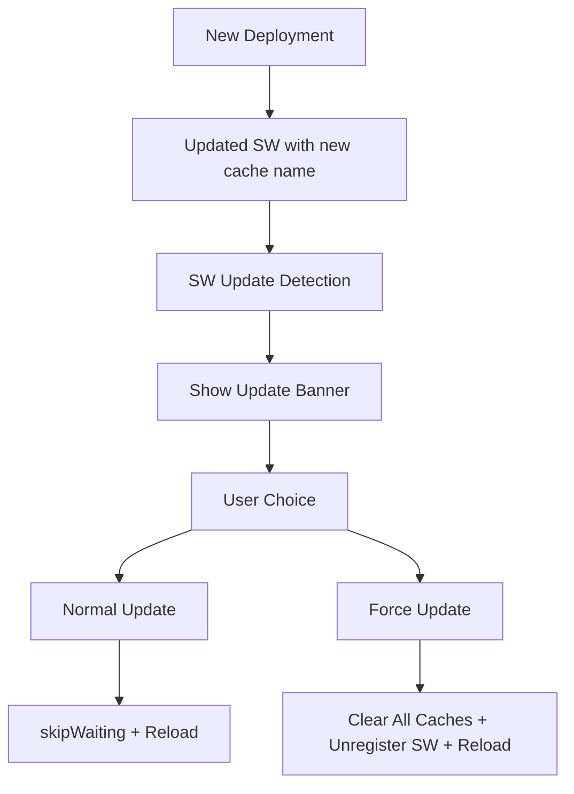

# PWA Cache Update Problem - Lösung

## Problem
Nachdem eine PWA installiert und später deinstalliert wurde, bleiben Service Worker und Browser-Caches aktiv. Das führt dazu, dass Benutzer auch nach neuen Deployments weiterhin die alte gecachte Version der Anwendung sehen.

## Symptome
- Neue Features sind nur im Inkognito-Modus sichtbar
- Normale Browser-Updates funktionieren nicht
- Hard-Refresh (Ctrl+F5) hilft nicht bei PWAs

## Implementierte Lösungen

### 1. Dynamische Cache-Versionierung
- **Problem**: Statische Cache-Namen führen zu veralteten Inhalten
- **Lösung**: Automatische Cache-Versionierung basierend auf Build-Zeit
- **Implementation**: `scripts/updateServiceWorkerVersion.mjs` wird bei jedem Build ausgeführt

### 2. Network-First-Strategie für HTML
- **Problem**: HTML-Dokumente werden aus dem Cache geladen
- **Lösung**: Network-First-Strategie für Navigation-Requests
- **Benefit**: Frische Inhalte bei verfügbarer Internetverbindung

### 3. Force-Update-Mechanismus
- **Problem**: Benutzer können keine Aktualisierung erzwingen
- **Lösung**: Mehrere Update-Optionen verfügbar

## Verfügbare Update-Optionen

### Option 1: Automatische Updates
Das System erkennt neue Versionen automatisch und zeigt ein Update-Banner mit:
- "Jetzt aktualisieren" - Normales Update
- "Force Update" - Aggressive Cache-Clearung
- "Später" - Update verschieben

### Option 2: Manuelle Force-Updates (für Entwickler/Power-User)
```javascript
// Im Browser-Console ausführen:
window.forceAppUpdate()

// Cache-Informationen anzeigen:
window.getCacheInfo()
```

### Option 3: Browser-Cache manuell löschen
1. Chrome: Entwicklertools → Application → Storage → Clear Storage
2. Firefox: Entwicklertools → Storage → Alle Daten löschen
3. Safari: Entwickeln → Leere Caches

## Build-Process-Integration

### Standard Build (mit Cache-Update)
```bash
npm run build
```

### Development Build (ohne Cache-Update)
```bash
npm run build:dev
```

### Nur Cache-Version aktualisieren
```bash
npm run update-sw-version
```

## Service Worker Verbesserungen

### Neue Features
- **FORCE_UPDATE Message**: Komplette Cache-Clearung
- **Häufigere Update-Checks**: Alle 60 Sekunden
- **Verbesserte Error-Behandlung**: Detailliertere Logging
- **Network-First für HTML**: Frische Inhalte garantiert

### Cache-Strategien
- **HTML/Navigation**: Network-First (immer frisch)
- **Statische Assets**: Cache-First (Performance)
- **API-Calls**: Network-Only (nicht gecacht)

## Deployment-Empfehlungen

### Für Entwickler
1. Immer `npm run build` verwenden (nicht `npm run build:dev`)
2. Nach jedem Deployment prüfen, ob Cache-Version aktualisiert wurde
3. Bei Problemen Force-Update-Funktion nutzen

### Für Benutzer mit Cache-Problemen
1. Warten auf automatisches Update-Banner
2. "Force Update" im Banner wählen
3. Bei anhaltenden Problemen: Browser-Cache manuell löschen
4. Letzte Option: `window.forceAppUpdate()` in Console

## Technische Details

### Cache-Namen-Schema
```
markdown-editor-pro-v{timestamp}
```

### Service Worker Update-Flow


## Monitoring und Debugging

### Console-Commands für Diagnose
```javascript
// Cache-Status prüfen
await window.getCacheInfo()

// Force-Update ausführen
await window.forceAppUpdate()

// Service Worker Status
navigator.serviceWorker.getRegistrations()

// PWA Installation Status
window.pwaManager?.getInstallationStatus()
```

### Entwickler-Tools
- **Chrome**: Application → Service Workers & Cache Storage
- **Firefox**: Application → Service Workers & Storage
- **Console Logs**: Alle PWA-Aktivitäten werden geloggt

## Zukünftige Verbesserungen

- [ ] Automatische Rollback-Mechanismen
- [ ] Benutzer-Benachrichtigungen über Updates
- [ ] Offline-Verfügbarkeits-Indikator
- [ ] Erweiterte Cache-Strategien
- [ ] Update-Verlauf und Changelog-Integration