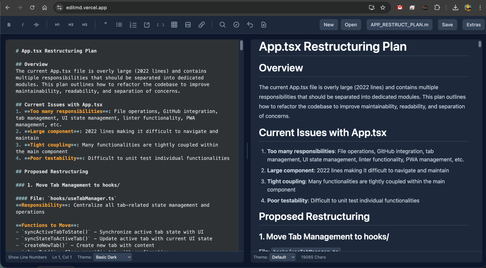

# Markdown Editor Pro

A powerful, lightweight, browser-based Markdown editor designed for simplicity, privacy, and productivity.

[](https://github.com/Etschmia/mark/blob/main/LICENSE)
[](https://github.com/Etschmia/mark)



## 🌟 Features

### 📝 **Core Editing**
- **Real-time Syntax Highlighting** - Professional CodeMirror 6 integration with Markdown support
- **Live Preview** - Instant HTML rendering with synchronized scrolling
- **Complete Formatting Toolbar** - Visual buttons for all Markdown elements
- **Multi-Tab Interface** - Work with multiple documents simultaneously
- **Search and Replace** - Powerful find/replace with regex support

### ⌨️ **Keyboard Productivity**
- **30+ Keyboard Shortcuts** - Full shortcut support for all formatting operations
- **Tab Management** - Efficient keyboard-based tab switching and management
- **Undo/Redo System** - Comprehensive history with configurable debounce time

### 📁 **File Operations**
- **Modern File System Integration** - Native file save/open with File System Access API
- **Legacy Browser Support** - Download/upload fallback for older browsers
- **Auto-Save to LocalStorage** - Never lose your work with persistent storage
- **GitHub Integration** - Direct file loading and saving to GitHub repositories
- **YAML Frontmatter Support** - Edit document metadata (title, date, description, tags, author) with visual editor

### 🎨 **User Experience**
- **Complete Theme System** - Full light/dark mode for entire interface with persistent settings
- **Progressive Web App** - Install as native app, works offline, with app shortcuts and notifications
- **Comprehensive Settings Modal** - Font size, debounce time, line numbers, auto-save preferences
- **No Registration Required** - Complete privacy, no cloud dependencies
- **Responsive Design** - Works perfectly on desktop and mobile
- **Intuitive Toolbar** - Visual buttons for all formatting options
- **Multiple Preview Themes** - Customizable preview styling with persistent selection
- **Offline Indicator** - Clear status when working without internet connection
- **CodeMirror Themes** - 30+ editor themes for personalized coding experience

## 🚀 Quick Start

**Prerequisites:** Node.js (v16 or higher)

```bash
# Clone and install
npm install

# Start development server
npm run dev

# Build for production
npm run build
```

## 📋 Keyboard Shortcuts

### Text Formatting
- `Ctrl/Cmd + B` - **Bold**
- `Ctrl/Cmd + I` - *Italic*
- `Ctrl/Cmd + D` - ~~Strikethrough~~
- `Ctrl/Cmd + E` - `Code`

### Headers
- `Ctrl/Cmd + 1` - # Header 1
- `Ctrl/Cmd + 2` - ## Header 2
- `Ctrl/Cmd + 3` - ### Header 3

### Lists & Structure
- `Ctrl/Cmd + U` - Unordered list
- `Ctrl/Cmd + O` - Ordered list
- `Ctrl/Cmd + Shift + C` - Checklist
- `Ctrl/Cmd + Q` - Blockquote
- `Ctrl/Cmd + T` - Table

### Editor Functions
- `Ctrl/Cmd + F` - Search and replace
- `Ctrl/Cmd + Z` - Undo
- `Ctrl/Cmd + K` - Insert link
- `Ctrl/Cmd + M` - Insert image

### Tab Management
- `Ctrl/Cmd + Shift + T` - New tab
- `Ctrl/Cmd + W` - Close tab (with unsaved changes protection)
- `Ctrl/Cmd + Tab` - Next tab
- `Ctrl/Cmd + Shift + Tab` - Previous tab
- `Ctrl/Cmd + 1-9` - Switch to tab by number

## 📤 Export Capabilities
- **Markdown** - Native .md file saving
- **HTML** - Complete standalone HTML documents with styling
- **PDF** - Professional PDF output with proper formatting
- **DOCX** - Microsoft Word documents with full Markdown support (headings, paragraphs, lists, blockquotes, code blocks, tables, images via base64 embedding), matching HTML styling (fonts, margins, borders) – browser-only generation using 'docx' library

## 🎯 Core Components

### `Editor.tsx`
- CodeMirror 6 integration with Markdown syntax highlighting
- Custom keyboard shortcuts for all formatting operations
- Search and replace functionality
- Real-time content synchronization
- 30+ CodeMirror themes for personalized experience

### `Preview.tsx`
- Live HTML rendering with marked.js
- Syntax highlighting for code blocks
- Multiple theme support
- Sanitized output with DOMPurify

### `Toolbar.tsx`
- Complete formatting controls
- File operations (New, Open, Save, Export)
- GitHub integration button
- Help system dropdown

## 🛠️ Technical Stack

- **Frontend:** React 19.1.1, TypeScript 5.8.2, Vite 7.0.6
- **Editor:** CodeMirror 6 with 30+ themes
- **Markdown Processing:** marked 16.2.1, DOMPurify 3.2.6
- **Syntax Highlighting:** highlight.js 11.11.1 (12+ languages)
- **Export:** jsPDF 3.0.2, html2canvas 1.4.1
- **GitHub Integration:** @octokit/rest 22.0.0
- **Styling:** Tailwind CSS utility classes
- **PWA:** Workbox, Web Manifest

## 📱 Progressive Web App

Install as a native application with:
- Offline functionality
- App shortcuts
- System notifications
- Home screen installation

## 🔐 Privacy & Security

- **Zero Data Collection** - No tracking, no analytics, no cloud storage
- **Client-Side Only** - All processing happens in your browser
- **No Registration Required** - Immediate access without account creation
- **XSS Protection** - DOMPurify sanitization of all HTML output
- **Secure GitHub OAuth** - Device flow authentication with token storage

## 🤝 Contributing

1. Fork the repository
2. Create your feature branch (`git checkout -b feature/AmazingFeature`)
3. Commit your changes (`git commit -m 'Add some AmazingFeature'`)
4. Push to the branch (`git push origin feature/AmazingFeature`)
5. Open a pull request

## 📄 License

Distributed under the GPL License. See `LICENSE` for more information.

## 🙏 Acknowledgments

- [CodeMirror](https://codemirror.net/) - Powerful code editor component
- [React](https://reactjs.org/) - JavaScript library for building user interfaces
- [Vite](https://vitejs.dev/) - Next generation frontend tooling
- [marked](https://marked.js.org/) - Markdown parser and compiler
- [DOMPurify](https://github.com/cure53/DOMPurify) - DOM-only, super-fast, uber-tolerant XSS sanitizer
- [highlight.js](https://highlightjs.org/) - Syntax highlighting for the web
- [jsPDF](https://github.com/parallax/jsPDF) - Client-side JavaScript PDF generation
- [html2canvas](https://html2canvas.hertzen.com/) - Screenshots with JavaScript
- [Octokit](https://github.com/octokit/octokit.js) - GitHub API client
- [Tailwind CSS](https://tailwindcss.com/) - Utility-first CSS framework